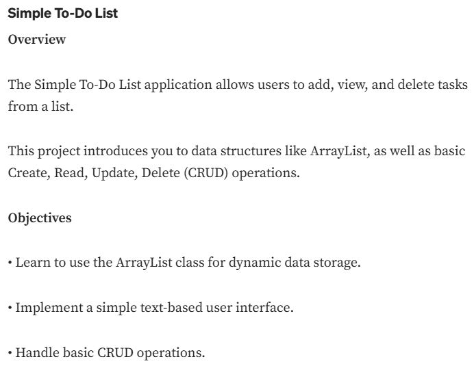

# To-Do List

- Duration:  27/9/2025 - 29/9/2025

## Functions
1. Add Task
2. Update Task
3. Delete Task
4. View Tasks
5. Exit

## Used
1. If...Else
2. Switch
3. While Loop
4. For Loop
5. Classes/Objects
6. Class Methods
7. Constructors
8. this Keyword
9. Encapsulation (getter)
10. Modifiers
11. User Input (Scanner)
12. ArrayList
13. Exceptions (Try...Catch)

## Tools and Technologies Used
- **IDE**: IntelliJ IDEA
- **Java SDK Version**: 17